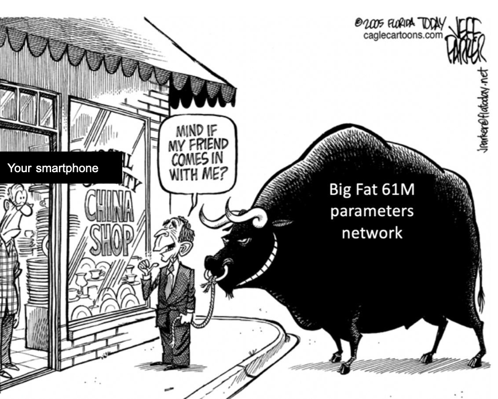

# Binary-code-based quantizer



Binary-code-based quantization (BCQ) is a powerful tool for transformers. It allows 1) extremely low bit quantization, and 2) hassle-free quantized inference (i.e. direct matmul between quantized weights and full precision activation is possible).

*Note:* This repo mainly replicates some parts of BCQ method discussed in [Chung & Kim et al. (2020)](https://aclanthology.org/2020.findings-emnlp.433/). The utilized dataset in this repo is different from the paper and code here does not fully include all the optimized inference functionalities. However, this repo should provide a good starting point for application of BCQ to your own use case.

# Binary-code-based quantization?

If you are unfamiliar with the BCQ approach, this [article](https://sites.google.com/view/insoochung/sub-3bit-quantization) may help.

# Tutorial

1. Install python module requirements (install reccommended on a virtual python environment recommended).

```bash
$ cd tf/
$ pip install -r requirements.txt
```

1. Pretrain full precision (FP) transformer. By default, a small en-pt dataset is utilized [[details]](https://www.tensorflow.org/datasets/catalog/ted_hrlr_translate#ted_hrlr_translatept_to_en).

```bash
$ python pretrain.py
# By default, model trains for 30 epochs.
...
Epoch 30/30
810/810 [==============================] - 96s 118ms/step - loss: 1.0415 - masked_accuracy: 0.7475 - val_loss: 2.1109 - val_masked_accuracy: 0.6362
...
# Once the training is finished, BLEU is computed from the first 200 sequences of the testset.
...
PT: por exemplo , vozes que ameaçavam atacar a minha casa aprendi a interpretá-las como o meu próprio sentimento de medo e insegurança no mundo , e não como um perigo real e objetivo .
EN: so for example , voices which threatened to attack my home i learned to interpret as my own sense of fear and insecurity in the world , rather than an actual , objective danger .
OUT: for example , voices that would threaten my home learned how my own fear of fear and insecurity in the world , and not as a real danger and goal .
PT: pronto , é uma marca muito significativa .
EN: all right . very significant mark .
OUT: all right , it ' s a very significant brand .
Testing, results and references are written to output.txt and ref.txt
Test BLEU: 0.2897125496960812
```

3. The [default configuration](/tf/hparams/small.json) results in 117MB checkpoints, but as this is a 10+M parameters the actual weights should be somewhere around 41MB. The difference comes from auxiliary parameters that tensorflow logs for various training functionality.

```bash
$ du -h trained_models/pretrained/*

4.0K	trained_models/pretrained/checkpoint
117M	trained_models/pretrained/pten.ckpt.ep0030.data-00000-of-00001
 36K	trained_models/pretrained/pten.ckpt.ep0030.index
```

4. Quantize pretrained transformer. The quantization starts by warmstarting from the FP checkpoint, then continuing to train for 30 epochs. At the end of every epoch, model weights are quantized to 3bit BCQ weights, evaluated, then saved.

```bash
$ python quantize.py

Epoch 1/30
810/810 [==============================] - 176s 186ms/step - loss: 0.9519 - masked_accuracy: 0.7628 - val_loss: 2.1906 - val_masked_accuracy: 0.6299 # Validation log before quantization
# Weights are quantized
Weights for 'encoder/pos_embedding/embedding' set to quantized-dequantized equivalent.
Weights for 'encoder/layer_0/self_attention/mha' set to quantized-dequantized equivalent.
...
Weights for 'decoder/layer_3/ffn/layer_norm' set to quantized-dequantized equivalent.
Weights for 'final_layer' set to quantized-dequantized equivalent.
# Validation is performed after quantization
19/19 [==============================] - 2s 45ms/step - loss: 4.5057 - masked_accuracy: 0.3190
# Quantized weights are saved if improved from previous epoch.
Epoch 1: masked_accuracy improved from -inf to 0.31903, saving model to trained_models/quantized/pten.ckpt.ep0001.bcq.npy
...
# Best epoch
Epoch 24/30
810/810 [==============================] - 96s 119ms/step - loss: 1.1256 - masked_accuracy: 0.7327 - val_loss: 2.0879 - val_masked_accuracy: 0.6387
Weights for 'encoder/pos_embedding/embedding' set to quantized-dequantized equivalent.
Weights for 'encoder/layer_0/self_attention/mha' set to quantized-dequantized equivalent.
...
Weights for 'decoder/layer_3/ffn/layer_norm' set to quantized-dequantized equivalent.
Weights for 'final_layer' set to quantized-dequantized equivalent.
19/19 [==============================] - 2s 45ms/step - loss: 2.0793 - masked_accuracy: 0.6377 # val loss and val masked_accuracy
Epoch 24: masked_accuracy improved from 0.63331 to 0.63770, saving model to trained_models/quantized/pten.ckpt.ep0024.bcq.npy
...
# Once the quantization process is finished, BLEU is evaluated.
PT: por exemplo , vozes que ameaçavam atacar a minha casa aprendi a interpretá-las como o meu próprio sentimento de medo e insegurança no mundo , e não como um perigo real e objetivo .
EN: so for example , voices which threatened to attack my home i learned to interpret as my own sense of fear and insecurity in the world , rather than an actual , objective danger .
OUT: for example , voices that would threat to attack my house learned how my own feeling of fear and insecurity in the world , not as a real danger and purpose .
PT: pronto , é uma marca muito significativa .
EN: all right . very significant mark .
OUT: all right , it ' s a very significant brand .
Testing, results and references are written to output.txt and ref.txt
Test BLEU: 0.28268006658937744

```

5. Final model size of the 3-bit transformer. *Note: bias and layer norm related parameters are not quantized, so the compression rate isn't exactly 32/3=10.7x*

```bash
$ du -h trained_models/quantized/*

5.6M	trained_models/quantized/pten.ckpt.ep0025.bcq.npy
5.6M	trained_models/quantized/pten.ckpt.ep0026.bcq.npy
```

# Things to consider

Code here is does not implement the full set of functionality discussed in [Chung & Kim et al. (2020)](https://aclanthology.org/2020.findings-emnlp.433/). Here are some of the things you should consider:

1. Depending on your dataset size, per-epoch quantization may be too often or too rare. Generally, quantizing every 500 to 2000 batches should work well. If your dataset is too small or too large, modulate the quantization frequency. This can be easily done by providing `steps_per_epoch` argument to `model.fit` method in the [`train` method here](/tf/train_utils.py).
2. Transformer code used here is based off [this tutorial](https://www.tensorflow.org/text/tutorials/nmt_with_attention). The training part of transformer is fully implemented, but the inference scheme is non-cached which is extremely slow. This is why the example code provided only uses 200 sentences for BLEU evaluation. For a more reliable evaluation, cached decoder steps should be implemented.
3. No on-device inference code. Fast quantized inference is a huge advantage of BCQ - but it will require a separate inference implementation that can be compiled and run on your target device to actual see the speed up.


# Files
```bash
.
├── README.md
└── tf # Tensorflow-based implementation of BCQ
    ├── hparams # Configuration for trained transformers.
    │   └── small.json
    ├── pretrain.py # Script for the initial step: training FP model as a starting point of BCQ.
    ├── quantize.py # Implements subsequent step: warm-starting from FP model to perform BCQ.
    ├── quantize_utils.py # Classes and methods relevant to BCQ
    ├── train_utils.py # Methods relevant to transformer training/inference
    ├── requirements.txt
    └── transformer # Transformer implementation based off: https://www.tensorflow.org/text/tutorials/nmt_with_attention
        ├── __init__.py
        ├── data.py
        ├── layers.py
        ├── model.py
        └── utils.py
```